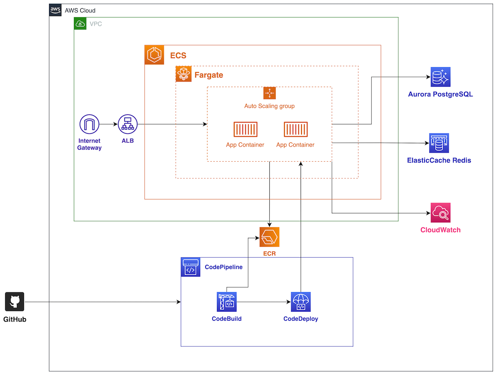

# My AWS Basic ECS Architecture with Terraform

## Architecture



## SETUP

git-secrets
```shell
cd /path/to/my/repo
git secrets --install
git secrets --register-aws
```

app_code
```shell
mv app_code/ ..

# Edit buildspec.yml, appspec.yml, taskdef.json to fit your project.
# See example.*.yml and example.taskdef.json.
# ${aws_region}, ${project_name} and ${account_id} will be replaced.
```

Terraform
```shell
touch terraform.tfvars
terraform init
terraform get
terraform plan
terraform apply
```

## Main Resources

### Other
1. Resource Group (by Project:project_name)

### Networking
1. VPC
2. Internet Gateway
3. 4 VPC endpoints  
   (ecr_api, ecr_dkr, s3, ecs_awslogs)
4. 4 Subnets  
   (public, private_container, private_db, private_endpoint)
5. 2 Route Tables
   (for public subnets, for private containers)
6. Security Group
   (for vpc_endpoints)

### ALB
1. ALB
2. 2 ALB Listeners
   (real & test)
3. 2 ALB Target Groups
   (Blue & Green)
4. Security Group for ALB

### ECS
1. ECR
2. Cluster
3. Service
4. Service Discovery (Cloud Map)
5. Task Definition
6. Auto Scaling Setting
7. Security Group for container
8. Cloud Watch Log Group
9. IAM Role for task_execution & task
10. 2 IAM Assume Role Policies

### Deploy
1. CodeCommit Repository
2. CodeBuild Project
3. CodeDeploy App
4. CodeDeploy Deployment Group
5. CodePipeline
6. CloudWatch Event rule
7. CloudWatch Event target
8. 4 IAM Roles for codebuild, codepipeline, cloudwatch_event, codedeploy
9. S3 bucket for codepipeline artifact
10. 2 SSM Parameters for docker_hub_username, password

### Application Repository Resources
1. buildspec.yml for CodeBuild
2. appspec.yaml & taskdef.json for CodeDeploy
